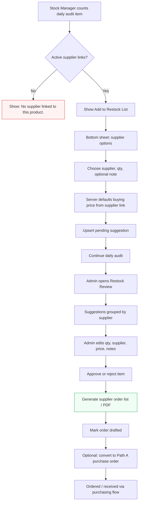

# Daily Audit Restock Recommendations

> **Extends:** `/inventory/stock-take/daily-audit`
> **Admin pages:** `/inventory/stock-take/restock`, `/inventory/stock-take/restock/orders`
> **Related workflow:** [DAILY_AUDIT.md](./DAILY_AUDIT.md)

This feature lets Stock Managers flag products for restocking while doing the Random Daily Stock Verification count. The Stock Manager only recommends. Admins review, adjust, approve/reject, and convert approved recommendations into supplier order lists or Path A purchase orders.

---

## Scope

| Area | Decision |
|---|---|
| Primary entry point | Daily audit wizard at `/inventory/stock-take/daily-audit` |
| General stock take | Out of scope for v1; can reuse the same drawer later |
| Recommendation owner | Stock Manager (`stocktake.run`) |
| Approval / ordering owner | Admin / owner / role with `stocktake.approve` |
| Supplier source | Active product-supplier links from `supplier_products` via `fetchItemSupplierLinks(itemId)` |
| Final order | V1 creates supplier order lists/PDFs; Path A purchase order conversion is an explicit admin action |

---

## User Flow



---

## Status Lifecycle

```
pending → approved → order_drafted → ordered → received
   │          │
   └──────────┴── rejected
```

| Status | Who | Meaning |
|---|---|---|
| `pending` | Stock Manager | Recommendation submitted and waiting for admin review |
| `approved` | Admin | Reviewed and ready for supplier ordering |
| `order_drafted` | Admin/system | Supplier order list/PDF generated, not yet placed |
| `ordered` | Admin/purchasing | Order was placed with supplier or converted to a PO |
| `received` | Purchasing/admin | Goods received through GRN / receiving flow |
| `rejected` | Admin | Declined with reason; excluded from ordering |

---

## Business Rules

| Rule | Detail |
|---|---|
| Daily audit linkage | Every suggestion stores `dailyAuditId`, `stockTakeSessionId`, and `stockTakeLineId`. |
| Product/supplier uniqueness | A pending suggestion is unique per `(businessId, branchId, dailyAuditId, itemId, supplierId)`. |
| Upsert behavior | Adding the same product for the same supplier again updates quantity and note instead of creating a duplicate. |
| Supplier eligibility | Only active supplier links for the counted product can be selected. Inactive/deleted suppliers are excluded. |
| No supplier | If no active supplier links exist, show: `No supplier linked to this product.` Do not allow a recommendation. |
| Price source | Buying price is server-defaulted from `defaultCostPrice`, then `lastCostPrice`. Stock Managers do not manually override price in v1. |
| Missing price | A pending item may have `buyingPrice = null`; Admin must enter price before approval/order generation. |
| Quantity unit | `suggestedQty` is stored in stock units by default. If supplier `packUnit` / `packSize` exists, UI displays it but does not convert silently. |
| Audit count independence | Restock recommendation does not change stock, count status, variance, or review status. |
| Approval | Stock Managers can recommend only. Admin approves/rejects and can edit supplier, qty, price, and notes. |
| Ordering | Only approved items can be included in an order draft/PDF or converted to a Path A purchase order. |
| Session deletion | Restock suggestions should be soft-retained for audit history; show deleted session context as unavailable. |

---

## Data Model

### New table: `stock_take_restock_items`

Recommended migration: `V134__stock_take_restock_items.sql`.

```sql
id                  varchar(36) primary key
business_id         varchar(36) not null
branch_id           varchar(36) not null
daily_audit_id      varchar(36) null
stock_take_session_id varchar(36) not null
stock_take_line_id  varchar(36) not null
item_id             varchar(36) not null
supplier_id         varchar(36) not null
suggested_qty       decimal(14,4) not null
buying_price        decimal(14,4) null
supplier_pack_size  decimal(14,4) null
supplier_pack_unit  varchar(32) null
note                text null
status              varchar(32) not null default 'pending'
rejection_reason    text null
added_by            varchar(36) not null
added_at            timestamp(6) not null
reviewed_by         varchar(36) null
reviewed_at         timestamp(6) null
order_drafted_by    varchar(36) null
order_drafted_at    timestamp(6) null
purchase_order_id   varchar(36) null
order_number        varchar(64) null
created_at          timestamp(6) not null
updated_at          timestamp(6) not null
version             bigint not null default 0
```

### Constraints and indexes

```sql
-- Enforce one active pending recommendation per daily audit item + supplier.
-- MySQL note: implement with generated status key or app-level lock if partial indexes are unavailable.
unique (business_id, branch_id, daily_audit_id, item_id, supplier_id, status)

index (business_id, branch_id, status)
index (business_id, daily_audit_id)
index (business_id, supplier_id, status)
index (stock_take_session_id)
index (stock_take_line_id)
```

If the database cannot express "unique only when pending", enforce pending uniqueness in `StockTakeRestockService` inside a transaction and allow historical `approved/rejected/ordered` rows.

---

## Supplier Link Data

Existing frontend type:

```ts
export type ItemSupplierLinkRecord = {
  id: string;
  supplierId: string;
  supplierName: string;
  primary: boolean;
  defaultCostPrice?: number | string | null;
  lastCostPrice?: number | string | null;
  packSize?: number | string | null;
  packUnit?: string | null;
  active: boolean;
};
```

Required extension for this feature:

```ts
lastPurchaseAt?: string | null;
```

Backend `SupplierProduct` already has `lastPurchaseAt`; expose it in `ItemSupplierLinkResponse` / `ItemSupplierLinkRecord` so the Stock Manager drawer can show last purchase date.

---

## API Types

```ts
export type StockTakeRestockItemStatus =
  | "pending"
  | "approved"
  | "order_drafted"
  | "ordered"
  | "received"
  | "rejected";

export type StockTakeRestockSupplierOptionRecord = {
  supplierId: string;
  supplierName: string;
  primary: boolean;
  defaultCostPrice: number | string | null;
  lastCostPrice: number | string | null;
  buyingPrice: number | string | null;
  packSize: number | string | null;
  packUnit: string | null;
  lastPurchaseAt: string | null;
};

export type StockTakeRestockItemRecord = {
  id: string;
  businessId: string;
  branchId: string;
  dailyAuditId: string | null;
  stockTakeSessionId: string;
  stockTakeLineId: string;
  itemId: string;
  itemName: string;
  itemSku: string | null;
  supplierId: string;
  supplierName: string;
  suggestedQty: number | string;
  buyingPrice: number | string | null;
  supplierPackSize: number | string | null;
  supplierPackUnit: string | null;
  lineTotal: number | string | null;
  addedById: string;
  addedByName: string;
  addedAt: string;
  notes: string | null;
  status: StockTakeRestockItemStatus;
  rejectionReason: string | null;
  reviewedBy: string | null;
  reviewedAt: string | null;
  purchaseOrderId: string | null;
  orderNumber: string | null;
  createdAt: string;
  updatedAt: string;
};

export type StockTakeRestockSupplierGroup = {
  supplierId: string;
  supplierName: string;
  supplierPhone: string | null;
  supplierEmail: string | null;
  supplierLocation: string | null;
  items: StockTakeRestockItemRecord[];
  supplierSubtotal: number | string | null;
};

export type StockTakeRestockReviewResponse = {
  branchId: string | null;
  dailyAuditId: string | null;
  auditDate: string | null;
  status: StockTakeRestockItemStatus | "all";
  groups: StockTakeRestockSupplierGroup[];
};

export type PostDailyAuditRestockPayload = {
  lineId: string;
  supplierId: string;
  suggestedQty: number | string;
  note?: string | null;
};

export type PatchStockTakeRestockPayload = {
  supplierId?: string;
  suggestedQty?: number | string;
  buyingPrice?: number | string | null;
  notes?: string | null;
};

export type RejectStockTakeRestockPayload = {
  reason: string;
};

export type GenerateRestockOrderPayload = {
  supplierIds?: string[];
  itemIds?: string[];
  adminNotes?: string | null;
  createPathAPurchaseOrders?: boolean;
};
```

---

## API Endpoints

Base path: `/api/v1/inventory/stock-take/restock-items`

| Method | Endpoint | Permission | Purpose |
|---|---|---|---|
| `GET` | `/daily-audit/sessions/{sessionId}/lines/{lineId}/supplier-options` | `stocktake.run` | Active supplier options for the counted item |
| `POST` | `/daily-audit/sessions/{sessionId}` | `stocktake.run` | Stock Manager adds/upserts restock suggestion |
| `GET` | `/review?branchId=&auditDate=&status=&supplierId=` | `stocktake.approve` | Admin grouped review across the audit/branch, not just one session |
| `PATCH` | `/{restockItemId}` | `stocktake.approve` | Admin edits qty, supplier, price, notes |
| `POST` | `/{restockItemId}/approve` | `stocktake.approve` | Approve one item; requires price |
| `POST` | `/{restockItemId}/reject` | `stocktake.approve` | Reject with reason |
| `DELETE` | `/{restockItemId}` | `stocktake.approve` | Remove pending/rejected item from active review |
| `POST` | `/generate-order` | `stocktake.approve` | Generate supplier order list/PDF and optionally Path A PO |
| `GET` | `/orders?from=&to=&supplierId=&status=` | `stocktake.approve` | Order draft/history list |
| `POST` | `/orders/{orderId}/mark-ordered` | `stocktake.approve` | Mark supplier order as placed |
| `POST` | `/orders/{orderId}/mark-received` | `stocktake.approve` or purchasing permission | Mark received or link to GRN |

### Why review is not session-only

Daily audit can have morning and evening sessions for the same manifest. Admin review should compile all pending suggestions for a branch/audit date so the same product + supplier does not appear twice just because it was counted in both sessions.

---

## Stock Manager UI

### Integration point

File: `frontend/app/(dashboard)/inventory/stock-take/daily-audit/page.tsx`

Add the restock action to the current item card in the one-item wizard.

| State | UI |
|---|---|
| Supplier lookup loading | Small loading row under the item metadata |
| No active supplier links | `No supplier linked to this product.` |
| One or more active links | Button: `Add to Restock List` |
| Existing pending suggestion | Show `Added to restock list` with current qty/supplier; clicking lets user update qty/note |

### Drawer behavior

Use `RestockDrawer` in `_components/RestockDrawer.tsx`.

Fields:

- Supplier option cards, sorted primary first, then lowest known price
- Price display:
  - `defaultCostPrice` if present
  - otherwise `lastCostPrice`
  - otherwise `Price missing - admin will enter`
- Last purchase date if `lastPurchaseAt` exists
- Pack info if `packUnit` / `packSize` exists
- Suggested quantity (`inputMode="decimal"`)
- Optional note

Example supplier options:

```text
Supplier A - KES 52 / piece - Last purchase: 2026-06-28
Supplier B - KES 50 / piece - Last purchase: 2026-07-01
Supplier C - KES 55 / piece
```

POST payload should not include buying price. The backend resolves and snapshots price from the selected supplier link to avoid Stock Manager-entered pricing drift.

---

## Admin Review Page

Route: `/inventory/stock-take/restock`

| Section | Content |
|---|---|
| Header | Branch/date filters, status filter, link to daily audit review |
| Supplier cards | Supplier contact, supplier subtotal, item count |
| Item rows | Product, SKU, qty, price, total, added by, added at, note, status |
| Edit controls | Quantity, supplier dropdown, buying price, notes |
| Actions | Approve, reject, remove, generate order |
| Empty state | `No restock suggestions yet.` |

Admin supplier changes must only allow active supplier links for that product. If the new supplier has no price, keep `buyingPrice = null` and require Admin to enter price before approval.

### Admin grouping example

```text
Supplier: Supplier A

Fresh Milk 500ml - Qty: 24 - Price: KES 52 - Total: KES 1,248
Bread 400g       - Qty: 10 - Price: KES 65 - Total: KES 650

Supplier Total: KES 1,898
```

---

## Ordering

### V1 decision

Generate **backend-owned supplier order drafts** and PDFs first. Do not create a purchase order automatically on approve.

Admin chooses when to convert approved items:

1. Select approved items or supplier groups.
2. Click `Generate supplier order`.
3. Backend groups by supplier and creates one order draft per supplier.
4. Backend marks included restock items `order_drafted`.
5. Admin can download PDF/order list.
6. Admin can optionally convert each order draft to a Path A purchase order.

### Path A integration

Existing Path A APIs are the formal purchasing flow. Restock order drafts should integrate with Path A through a dedicated service method so the created PO can store `purchaseOrderId` / `orderNumber` back on each restock item.

Do not depend only on `PathAPurchaseOrderListRowRecord`; add/create the missing frontend `postPathAPurchaseOrder` API if needed.

---

## Existing Infrastructure to Leverage

| Existing | How it is used |
|---|---|
| `DailyStockAuditService` / daily audit routes | Source session and line context |
| `StockTakeSession` / `StockTakeLine` | Parent count session and counted item |
| `ItemSupplierLinkRecord` | Supplier options, active flag, prices, pack fields |
| `SupplierProduct.lastPurchaseAt` | Add to supplier-link response for drawer display |
| `SupplierRecord` / supplier contacts | Supplier grouping and PDFs |
| `PathAPurchaseService` | Optional formal PO conversion |
| `Permission.StocktakeRun` | Stock Manager recommendation permission |
| `Permission.StocktakeApprove` | Admin review/order permission |
| `APP_ROUTES.inventoryStockTakeDailyAudit` | Stock Manager entry point |

---

## Routes to Register

```ts
inventoryStockTakeRestock: "/inventory/stock-take/restock",
inventoryStockTakeRestockOrders: "/inventory/stock-take/restock/orders",
```

Add both routes to:

- Inventory sidebar/flyout for admins
- Stock take hub quick links
- Page title map (`shell-page-titles.ts`)
- Admin dashboard quick access if useful

---

## Files to Create / Modify

### Frontend new files

```text
frontend/app/(dashboard)/inventory/stock-take/
├── restock/
│   ├── page.tsx
│   └── orders/page.tsx
└── _components/
    ├── RestockDrawer.tsx
    ├── RestockSupplierCard.tsx
    └── RestockOrderPdfPreview.tsx
```

### Frontend modified files

```text
frontend/app/(dashboard)/inventory/stock-take/daily-audit/page.tsx
frontend/lib/api.ts
frontend/lib/config.ts
frontend/lib/shell-page-titles.ts
frontend/components/app-shell.tsx
frontend/components/shell/desktop-nav-rail.tsx
```

### Backend new files

```text
backend/src/main/resources/db/migration/V134__stock_take_restock_items.sql
backend/src/main/java/zelisline/ub/inventory/domain/StockTakeRestockItem.java
backend/src/main/java/zelisline/ub/inventory/repository/StockTakeRestockItemRepository.java
backend/src/main/java/zelisline/ub/inventory/application/StockTakeRestockService.java
backend/src/main/java/zelisline/ub/inventory/api/StockTakeRestockController.java
backend/src/main/java/zelisline/ub/inventory/api/dto/StockTakeRestockDtos.java
backend/src/main/java/zelisline/ub/inventory/application/StockTakeRestockOrderService.java
```

### Backend modified files

```text
backend/src/main/java/zelisline/ub/suppliers/api/dto/ItemSupplierLinkResponse.java
backend/src/main/java/zelisline/ub/suppliers/application/ItemSupplierLinkService.java
backend/src/main/java/zelisline/ub/purchasing/application/PathAPurchaseService.java (only if converting drafts to formal POs)
```

---

## Implementation Order

| Phase | What | Done when |
|---|---|---|
| 1 | Migration + entity + repository | Pending uniqueness/upsert is enforceable |
| 2 | Supplier options endpoint | Drawer can show active suppliers, price, pack info, last purchase date |
| 3 | Stock Manager drawer in daily audit | SM can add/update recommendation without leaving count screen |
| 4 | Admin review page | Admin can group, edit, approve, reject, remove |
| 5 | Backend order drafts + PDFs | Approved items become supplier order drafts |
| 6 | Optional Path A conversion | Order drafts can create/link formal purchase orders |
| 7 | Order history | Admin can view drafts/orders and statuses |

---

## Testing Plan

### Backend integration tests

- Supplier options returns only active links for the counted item.
- Item with no suppliers returns empty options and POST is rejected.
- POST upserts pending `(dailyAuditId, itemId, supplierId)` instead of duplicating.
- POST snapshots supplier price/pack fields from `supplier_products`.
- Missing supplier price keeps pending item but approval fails until Admin sets price.
- Admin can change supplier only to another active link for the same item.
- Approved items can be included in supplier order draft.
- Rejected items are excluded from order generation.
- Stock Manager cannot approve/reject/order.

### Frontend tests / QA

- Daily audit card shows `No supplier linked to this product.` when no active links exist.
- Supplier drawer lists all active suppliers with price and pack info.
- Primary supplier appears first.
- Quantity input opens numeric keypad on mobile.
- Admin review groups rows by supplier and calculates subtotals.
- Admin cannot approve without buying price.

---

## Dependencies

Prefer backend-generated PDFs/order documents so order history is auditable. Avoid adding frontend PDF dependencies for v1 unless backend generation is blocked.

If frontend PDF preview is still needed later, add one dependency through the package manager:

```json
{
  "@react-pdf/renderer": "latest"
}
```

---

## Resolved Product Decisions

| Question | Decision |
|---|---|
| Session-scoped or global? | Daily-audit scoped for v1; store session/line for traceability, enforce pending uniqueness by audit item + supplier. |
| PDF or formal PO? | Backend supplier order draft/PDF first; Path A conversion is explicit admin action. |
| Backend or frontend PDF? | Backend-owned for storage, audit, and order history. |
| Supplier contact source | Use supplier contacts if available; allow generated order to snapshot contact text for audit. |
| Persist after session deletion? | Soft-retain suggestions; show deleted/missing session context gracefully. |
| Who enters price? | Backend snapshots supplier link price; Admin enters/edits missing price before approval. |
