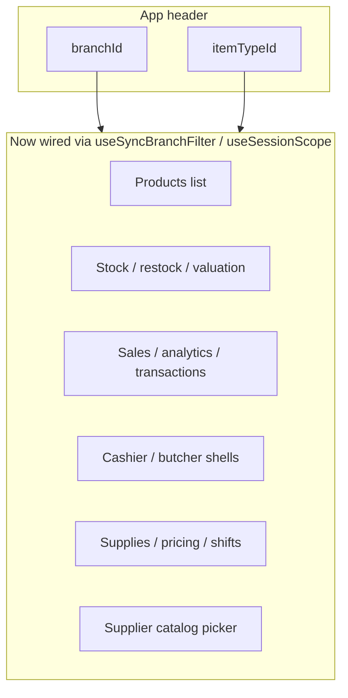

# Global branch & department (item type) scope

> **Goal:** When a user picks **Branch** or **Department** (item type) in the app header, that selection drives data loading, filters, and defaults on every dashboard surface — products, suppliers, cashier, inventory, sales, analytics, etc. — unless a page has a deliberate, documented reason to ignore it.

**Status:** Implemented (Phases 0–5 + D1/D6 + B6); automated tests for sync rules and scope guards; see §4 audit for per-page status  
**Last reviewed:** 2026-07-02  
**Feature flag:** `global_scope_v2` — not present in codebase; behavior is default (Phase 5 N/A)

---

## 1. Glossary

| Term | Meaning |
|---|---|
| **Branch** | A physical location (e.g., “Mirema Drive”). Scoped data includes stock, pricing, sales, shifts, etc. |
| **Department / Item type** | A catalog taxonomy level (e.g., “Retail Shop ★”). Routes and DB use `itemTypeId`; UI often shows “Department.” |
| **Header scope** | The `branchId` + `itemTypeId` held in `DashboardProvider` and surfaced in `AppShell`. |
| **Branch-locked role** | Roles that cannot switch branches: `stock_manager`, `cashier`, `butcher_cashier`, `grocery_clerk`. |
| **Department-restricted role** | Roles whose department picker is filtered to an admin-assigned subset. Today only `grocery_clerk` uses `me.itemTypeIds`. |
| **Scope drift** | A page-level picker or local state that no longer matches the header selection. |
| **All-branches mode** | A report/page that intentionally shows data across branches. |
| **All-departments mode** | A catalog search/page that intentionally shows items from every department. |

---

## 2. Current architecture

### 2.1 Source of truth — `DashboardProvider`

File: `frontend/components/dashboard-provider.tsx`

| Field | Storage key | Seeding order |
|---|---|---|
| `branchId` | `palmart:selectedBranch:v1:{businessId}` | persisted value → `me.branchId` (if locked role) → first active branch |
| `itemTypeId` | `palmart:selectedItemType:v1:{businessId}` | Empty string = **All departments** (D1); otherwise persisted id → default type → first active type |

Exposed via `useDashboard()`:

- `branchId`, `setBranchId`, `branches`, `branchesLoading`, `refreshBranches`
- `itemTypeId`, `setItemTypeId`, `itemTypes`, `itemTypesLoading`, `refreshItemTypes`
- `me`, `business`, loading/refresh helpers, and permission flags used for menu/feature gating

Key details not in the original scope:

- `itemTypes` are filtered for `grocery_clerk`: only departments in `me.itemTypeIds` are shown; if none are assigned the list is empty.
- Branch selection is blocked for branch-locked roles via `isBranchLockedRole` (`frontend/lib/branch-access.ts`).
- `userTouchedBranchRef` / `userTouchedItemTypeRef` prevent overwriting a user’s explicit choice when re-seeding.

### 2.2 Header UI — `AppShell`

File: `frontend/components/app-shell.tsx`

- Desktop header: branch `<select>` + department `<select>` + logout
- Tablet: branch/department shown in `TabletAppHeader`; pickers in `TabletMoreSheet`
- Locked roles see a read-only branch badge instead of the branch dropdown
- Department picker for `grocery_clerk` shows only assigned departments

The screenshot context (“Kiosk - Fabian”, “Mirema Drive”, “Retail Shop”) maps to:

- **Branch** → `branchId` / `currentBranch.name`
- **Type / Department** → `itemTypeId` / `currentItemType.label` (e.g. “Retail Shop ★”)

### 2.3 Layout wiring

```
AuthenticatedShellGate
  └── DashboardProvider          ← session + branch + itemType
        └── AppShell             ← header selectors
              └── (dashboard)/…  ← page content
```

**Outside main dashboard shell:**

| Route | Provider | Header selectors |
|---|---|---|
| `/cashier` | Own `DashboardProvider` + `CashierShell` | Duplicate branch picker + local POS `itemTypeId` seeded from header but override-able |
| `/butcher` | `ButcherShell` (uses `useDashboard`) | Duplicate branch picker in butcher chrome |
| `/grocery` | Inside dashboard `AppShell` | Uses global header |

### 2.4 Role-based scope restrictions

| Role | Branch | Department | Notes |
|---|---|---|---|
| `stock_manager` | Locked to `me.branchId` | Free choice | |
| `cashier` | Locked to `me.branchId` | Free choice | |
| `butcher_cashier` | Locked to `me.branchId` | Free choice | Redirected to `/butcher` |
| `grocery_clerk` | Locked to `me.branchId` | Restricted to `me.itemTypeIds` | Redirected away from `/cashier` |
| Owner / manager | Free choice | Free choice | |

---

## 3. API support (frontend client)

### 3.1 Verified client functions

The table below reflects the actual signatures in `frontend/lib/api.ts` as of this review.

| Client function | Endpoint | `branchId` | `itemTypeId` | Caller usage today | Gap |
|---|---|---|---|---|---|
| `fetchItemsPage` | `GET /api/v1/items` | ✅ | ✅ | Products, supplier catalog picker, stock attention filters | Some callers omit `itemTypeId` |
| `fetchCatalogListStats` | `GET /api/v1/items/row-type-counts` | ✅ | ✅ | Products stats bar | Some callers omit `itemTypeId` |
| `fetchItemById` | `GET /api/v1/items/:id` | ✅ | ❌ | Product detail panel | Type filter not applicable |
| `fetchInventoryValuation` | `GET /api/v1/inventory/valuation` | ✅ | ❌ | Valuation page | No type filter |
| `fetchPathBSupplies` | `GET /api/v1/purchasing/supplies` | ✅ | ❌ | Supplies list | Now passes dashboard `branchId` |
| `fetchSuppliersPage` | `GET /api/v1/suppliers` | ❌ | ❌ | Suppliers list | Vendor master stays global by design |
| Supplier catalog picker (`SupplierCatalogColumn.tsx`) | `GET /api/v1/items` | ✅ | ✅ | Link products to supplier | Now passes dashboard `branchId` + `itemTypeId` |
| `fetchCategories` | `GET /api/v1/categories` | ❌ | ❌ | Category filters | Business-wide taxonomy |

Other surfaces (sales register, analytics, staff performance, payments by method, etc.) already consume `branchId` in their client functions. Whether they should also accept `itemTypeId` is a product decision documented in §7.

### 3.2 Backend questions to confirm

- Does `GET /api/v1/items` fully honor `itemTypeId` for all `catalogScope` values?
- Does `GET /api/v1/inventory/valuation` support `itemTypeId` if we want department-level valuation?
- Does `GET /api/v1/purchasing/supplies` fully honor `branchId` on the backend?
- Which analytics endpoints should accept `itemTypeId` for department-level P&L?

---

## 4. Page-by-page audit

Legend:

- ✅ **Wired** — reads global selection and applies it
- 🟡 **Partial** — seeds from global once, or only uses one dimension, or allows local override
- ❌ **Not wired** — ignores header selection
- ➖ **N/A** — org/settings pages where branch/type filter does not apply
- **Status:** `Implemented` / `Partial` / `Not started`

### 4.1 Catalog

| Page / component | Branch | Item type | Status | Notes |
|---|---|---|---|---|
| **Products** (`products-workspace.tsx`) | ✅ | ✅ | Implemented | `branchId` → stock, pricing, detail. `dashboardItemTypeId` → list + create defaults; `ProductHeroHeader` shows active scope |
| **Products catalog** (`products/catalog/page.tsx`) | ✅ | ➖ | Implemented | Global catalog (no `itemTypeId` filter); adopt default uses header `branchId`; scope subtitle shown |
| **Categories** | ➖ | ➖ | N/A | Business-wide taxonomy |
| **Departments** (`item-types/page.tsx`) | ➖ | ➖ | N/A | Admin CRUD for types themselves |

### 4.2 Procurement

| Page / component | Branch | Item type | Status | Notes |
|---|---|---|---|---|
| **Suppliers** (`suppliers/page.tsx`) | ❌ | ❌ | Implemented (global) | Supplier master list intentionally unscoped (D3=A) |
| **Supplier catalog column** | ✅ | ✅ | Implemented | `fetchItemsPage` with header `branchId` + `itemTypeId` |
| **Receive supplies** (`new-supply-drawer.tsx`) | ✅ | ❌ | Implemented | Uses dashboard `branchId`; D6 guard when draft open |
| **Supplies list** (`supplies/page.tsx`) | ✅ | ❌ | Implemented | `fetchPathBSupplies({ branchId })`; reloads on header change |
| **Supplier intelligence** | ✅ | ❌ | Implemented | Metrics scoped by header `branchId` |
| **AP aging / Record payment** | ❌ | ❌ | Implemented (global) | Payables are supplier-level |

### 4.3 Inventory

| Page / component | Branch | Item type | Status | Notes |
|---|---|---|---|---|
| **Stock levels** (`stock-levels-page.tsx`) | ✅ | ✅ | Implemented | Two-way branch sync; `itemTypeId` on `fetchItemsPage` |
| **Out of stock** (`inventory/restock/page.tsx`) | ✅ | ❌ | Implemented | `useSyncBranchFilter` |
| **Valuation** | ✅ | ❌ | Implemented | Apply-branch banner (§9); `allowAll: true` |
| **Stock transfers** | ✅ | ❌ | Implemented | `fromBranchId` two-way sync with header; `toBranchId` user-selected; D6 guard on draft |
| **Stock take** | ✅ | 🟡 | Implemented | `useSyncBranchFilter` + D6 guard; create uses header `itemTypeId` |
| **Reconciliation** | ✅ | ❌ | Implemented | `useSyncBranchFilter` |
| **Supply batches** | ✅ | ❌ | Implemented | `useSyncBranchFilter` with `allowAll: true` |
| **Batch dashboard** | ✅ | ❌ | Implemented | `useSyncBranchFilter` with `allowAll: true` |

### 4.4 Operations

| Page / component | Branch | Item type | Status | Notes |
|---|---|---|---|---|
| **Pricing** | ✅ | ❌ | Implemented | `sellBranchId` from header; D6 guard on sell drawer |
| **Shifts** | ✅ | ❌ | Implemented | `useSyncBranchFilter` with `allowAll: true` |

### 4.5 Sales & POS

| Page / component | Branch | Item type | Status | Notes |
|---|---|---|---|---|
| **Business hub** (`business/page.tsx`, was `/overview`) | ✅ | ✅ | Implemented | Default owner landing; KPIs branch-scoped; catalogue count uses `branchId` + `itemTypeId`; owner summary API remains business-wide; `/overview` redirects here |
| **Sales** (`sales-overview-page.tsx`) | ✅ | ❌ | Implemented | `useSyncBranchFilter` + two-way bind; `allowAll` |
| **Transactions** | ✅ | ❌ | Implemented | Same as sales overview |
| **Pending carts** | ✅ | ❌ | Implemented | Uses dashboard `branchId` directly |
| **Sales reports** | ✅ | ❌ | Implemented | Branch filter + `fetchSalesRevenueByCategory(..., branchId)` |
| **Analytics** | ✅ | ❌ | Implemented | Apply-branch banner (§9); category revenue branch-scoped |
| **Activity** | ✅ | ❌ | Implemented | `useSyncBranchFilter` + two-way bind |
| **Quick sale** (dashboard) | ✅ | ✅ | Implemented | Header scope + D6 cart guard + checkout confirm |
| **Cashier PWA** (`/cashier`) | ✅ | ✅ | Implemented | Branch/type driven by dashboard header; no local POS override (duplicate pickers removed) |
| **Grocery counter** | ✅ | ➖ | Implemented | All-departments search (D4=A) |
| **Butcher counter** | ✅ | ➖ | Implemented | Branch read-only from dashboard; duplicate branch picker removed; D6 cart guard + checkout confirm; butcher categories not header types |

### 4.6 Organization / settings

| Page | Branch | Item type | Status | Notes |
|---|---|---|---|---|
| Business, branding, users, branches, payments, desktop, customers, promotions | ➖ | ➖ | N/A | Correct to remain global |

---

## 5. Problem summary (resolved)

The issues below were identified during planning and are **addressed** in the current implementation. Kept here as historical context.



### 5.1 Branch — anti-patterns (resolved)

| Anti-pattern | Resolution |
|---|---|
| Duplicate pickers drifting from header | `useSyncBranchFilter` + two-way bind on report pages (D2) |
| One-time seed without reload | Ongoing sync or apply-branch banner (§9) |
| No seed at all | All operational pages seed from `DashboardProvider` |

### 5.2 Item type — resolved

- Products grid, supplier catalog picker, and stock search pass `itemTypeId`.
- Cashier syncs to header with explicit “All types” override (D5).
- Analytics category revenue is branch-scoped; department on reports remains N/A unless API adds support.

---

## 6. Target behavior (product rules)

### 6.1 Branch

| Rule | Detail |
|---|---|
| **B1 — Single source** | Header `branchId` is authoritative for all branch-scoped reads/writes. |
| **B2 — React to changes** | When header branch changes, active pages refetch or show an “Apply / stale data” banner if the fetch is expensive. |
| **B3 — Locked roles** | Always `me.branchId`; hide redundant pickers. |
| **B4 — Page pickers** | Either **remove** duplicate dropdowns and show read-only context, **or** two-way bind them to `setBranchId` so the header updates when the page changes. |
| **B5 — Multi-branch off** | When `multi_branch` feature flag is false, show branch name read-only everywhere. |
| **B6 — Stale selection** | **Implemented** — `dashboard-provider` falls back to `me.branchId` or first active branch and shows a one-time toast when persisted branch/department is invalid. |

### 6.2 Department (item type)

| Rule | Detail |
|---|---|
| **T1 — Catalog filter** | When `itemTypeId` is set, item lists (products, supplier catalog, stock search, POS catalog) pass `itemTypeId` to `fetchItemsPage`. |
| **T2 — “All departments”** | ✅ Implemented (D1=B): header allows clearing `itemTypeId`; empty omits `itemTypeId` on catalog API calls. |
| **T3 — Create defaults** | New products, variants, stock-take lines inherit header `itemTypeId`. |
| **T4 — Non-catalog pages** | Suppliers/vendors master data stays unfiltered; supply **lines** respect type when picking products. |
| **T5 — Grocery exception** | Grocery counter may stay all-departments unless product asks otherwise (existing comment). |
| **T6 — Restricted roles** | ✅ `grocery_clerk` with one assigned department → read-only department picker (desktop + tablet). |

### 6.3 Role-based restrictions

| Role | Header branch picker | Header department picker |
|---|---|---|
| Owner / manager | Editable | Editable |
| `stock_manager`, `cashier`, `butcher_cashier` | Read-only (`me.branchId`) | Editable |
| `grocery_clerk` | Read-only (`me.branchId`) | Editable but filtered to `me.itemTypeIds`; read-only if single assignment |

### 6.4 UX consistency

- **Implemented:** `ActiveScopeSubtitle` / `DashboardPageHero showActiveScope` on scoped pages (inventory, sales, analytics, pricing, shifts, supplies, overview).
- Show active scope in page hero/subtitle: `Mirema Drive · Retail Shop`.
- Disable stock attention filters (zero/low stock) when no branch is selected.
- Empty states should say which branch/type is active.
- Locked-role pages should show a non-editable scope badge instead of a picker.

---

## 7. Implementation plan

### 7.1 Rollout flag

Introduce `global_scope_v2` (tenant feature flag). Pages can opt into new sync behavior one at a time. Once all surfaces are migrated, the flag becomes the default and the old drift code is removed.

### 7.2 Phase 0 — Shared hooks + API contract

**New file:** `frontend/hooks/use-session-scope.ts`

```ts
// useSessionBranch() → { branchId, setBranchId, branchName, branchLocked, branches }
// useSessionItemType() → { itemTypeId, setItemTypeId, itemTypeLabel, itemTypes, restricted }
// useSyncBranchFilter(local, setLocal) → keeps local filter in sync with header
```

`useSyncBranchFilter` should copy the **analytics** pattern:

- On `sessionBranchId` change → update local filter **and** trigger reload.
- Respect `isBranchLockedRole`.
- Optional `allowAll: true` for report pages that support “All branches.”

**API contract:** Confirm or add backend query params before frontend wiring:

| Endpoint | Add `branchId` | Add `itemTypeId` | Owner |
|---|---|---|---|
| `GET /api/v1/purchasing/supplies` | Ensure backend honors it | Decide if needed | Backend |
| `GET /api/v1/inventory/valuation` | Already supported | Decide if needed | Backend |
| Analytics endpoints | Already supported | Decide if needed | Backend |

### 7.3 Phase 1 — Remove drift (high impact, low risk)

| File | Change |
|---|---|
| `inventory/restock/page.tsx` | Replace local init with `useSyncBranchFilter`; follow header changes |
| `inventory/valuation/page.tsx` | Sync ongoing, not only initial seed |
| `inventory/stock-take/reconciliation/page.tsx` | Seed from dashboard `branchId` |
| `inventory/supply-batches/...` | Seed `branchFilter` from dashboard |
| `shifts/page.tsx` | Seed + sync `branchFilter` for non-locked roles |
| `components/inventory/stock-levels-page.tsx` | Two-way bind page picker to `setBranchId` **or** remove picker |
| `supplies/page.tsx` | Pass dashboard `branchId` to `fetchPathBSupplies` |

### 7.4 Phase 2 — Item type on catalog surfaces

| File | Change |
|---|---|
| `products/_hooks/useCatalogList.ts` | Already accepts `itemTypeId`; ensure all callers pass it |
| `products/products-workspace.tsx` | Already passes `dashboardItemTypeId`; verify no regressions |
| `suppliers/_components/SupplierCatalogColumn.tsx` | Pass `branchId` + `itemTypeId` from `useDashboard` |
| `components/inventory/stock-levels-page.tsx` | Pass `itemTypeId` to item fetch if API supports stock-by-type |
| `components/cashier-shell.tsx` | Keep POS seed from header but add an explicit “Sync to header” action; remove duplicate branch picker |
| `components/cashier/quick-sale-workspace.tsx` | Use dashboard `itemTypeId` when no local override is active |

### 7.5 Phase 3 — Procurement & operations

| File | Change |
|---|---|
| `supplies/page.tsx` | Add client-side branch filter on supply bills (backend already supports `branchId`) |
| `pricing/page.tsx` | Default `sellBranchId` from header; separate cost-price behavior if needed |
| `purchasing/intelligence/page.tsx` | Scope metrics by branch if API supports |
| `sales-reports/*`, `analytics/activity/*` | Wire branch and decide on item type |

### 7.6 Phase 4 — POS shells

| File | Change |
|---|---|
| `components/butcher/butcher-shell.tsx` | Remove duplicate branch picker; rely on dashboard header when embedded in full app |
| `app/cashier/layout.tsx` | Consider lightweight header strip showing global selectors (cashier has no `AppShell`) |

### 7.7 Phase 5 — Clean-up

- **Done:** Local `prevSessionBranchId` mirrors removed; `useSyncBranchFilter` is the standard pattern.
- **Kept:** `PosCatalogItemTypeContext` for cashier “All types” override (D5).
- **N/A:** `global_scope_v2` flag was never added to the codebase.
- **Done:** `ActiveScopeSubtitle` via `DashboardPageHero showActiveScope` on all major scoped surfaces; custom headers on business hub, sales, analytics, restock.

---

## 8. Decision log

| # | Question | Status | Recommendation | Owner | Date |
|---|---|---|---|---|---|
| D1 | Should header department allow **“All departments”**? | **Decided — B** | **B** — Add “All” option that clears `itemTypeId` | Product | 2026-07-02 |
| D2 | Duplicate branch pickers on analytics/sales/stock | **Decided — B** | **B** — Two-way sync with header on report pages; remove on operational pages | Product | 2026-07-02 |
| D3 | Suppliers **list** (vendors) | **Decided — A** | **A** — Stay global | Product | 2026-07-02 |
| D4 | Grocery counter + item type | **Decided — A** | **A** — Keep all-departments | Product | 2026-07-02 |
| D5 | Cashier `/cashier` without `AppShell` | **Decided — removed** | Remove local pickers; show read-only scope context. Scope still syncs via `DashboardProvider`/localStorage. | Product | 2026-07-02 |
| D6 | Changing branch mid-form (supply draft, stock edit) | **Decided — A** | **A** — Warn; per-flow rules in §9 | Product | 2026-07-02 |

---

## 9. Branch-change behavior per surface

| Surface | Header branch change | Rationale |
|---|---|---|
| Products list | Auto-refetch | Cheap, expected |
| Stock levels | Auto-refetch | Cheap |
| Restock | Auto-refetch | Cheap |
| Valuation | Apply-branch banner → user clicks Apply | Expensive; implemented in `inventory/valuation/page.tsx` |
| Supply batches | Auto-refetch | Medium cost |
| Shifts | Auto-refetch | Medium cost |
| Sales / transactions | Auto-refetch | Medium cost |
| Analytics | Apply-branch banner → user clicks Apply | Expensive; implemented in `analytics-workspace.tsx` |
| Product create/edit drawer | Update defaults only; do not reset dirty form | User is mid-edit |
| New supply drawer | Warn if draft has lines | Delivery branch is part of draft |
| Stock take in progress | Warn / lock | Counts are branch-specific |
| Stock transfer draft | Warn if lines / to-branch / notes entered | `inventory/transfers/page.tsx` |
| Pricing bulk edit | Warn / lock | Could silently change target prices |
| Cashier cart | Keep cart but warn on checkout if branch changed | Cart items may not exist in new branch |
| Butcher cart | Keep cart but warn on checkout if branch changed | D6 guard + checkout confirm in `butcher-cashier-workspace.tsx` |

---

## 10. Testing checklist

### Branch

- [ ] Select branch A in header → open Products, Stock, Sales, Analytics → all show branch A data.
- [ ] Switch to branch B in header **without navigation** → each page reloads or shows sync banner per §9.
- [ ] Locked role (cashier) → cannot change branch; all pages use assigned branch.
- [ ] `multi_branch=false` → read-only branch label everywhere.
- [ ] Persist across refresh (localStorage).
- [ ] Cashier PWA picks up same persisted branch as dashboard.
- [ ] Deleted/inactive branch in localStorage → falls back to first active branch with a notice.

### Item type

- [ ] Select “Retail Shop” in header → Products list only shows that department’s items.
- [ ] Supplier “Link product” picker respects department.
- [ ] Create product → department pre-filled from header.
- [ ] Cashier catalog search scoped to header department (when D4 resolved).
- [ ] Switch department → catalog lists update.
- [ ] `grocery_clerk` only sees assigned departments; single assignment → read-only picker.

### Regression

- [ ] Grocery invoices still work for grocery clerk role.
- [ ] Butcher counter categories independent of grocery departments.
- [ ] Stock zero/low filters still require branch.
- [ ] Global catalog (`/products/catalog`) behavior documented if exempt.
- [ ] Supplier master list remains unfiltered.

### 10.1 Where to verify (code map)

| Checklist item | Primary file(s) |
|---|---|
| Header → page data sync | `hooks/use-session-scope.ts` (`useSyncBranchFilter`), `dashboard-provider.tsx` |
| Analytics / valuation banner | `analytics/analytics-workspace.tsx`, `inventory/valuation/page.tsx` |
| B6 stale branch toast | `dashboard-provider.tsx` |
| D6 mid-form guards | `hooks/use-scope-change-guard.ts`, `lib/scope-change-guard.ts` |
| Products department filter | `products/_hooks/useCatalogList.ts` |
| Stock filters need branch | `products/_components/ProductFilterSidebar.tsx`, `stock-levels-page.tsx` |
| Cashier shared localStorage | `cashier-shell.tsx`, `dashboard-provider.tsx` |
| Grocery clerk department lock | `app-shell.tsx`, `tablet-app-chrome.tsx` |
| Active scope subtitle | `components/active-scope-subtitle.tsx`, `DashboardPageHero showActiveScope` |
| Branch sync rules | `lib/sync-branch-filter.ts`, `lib/sync-branch-filter.test.ts` |
| D6 confirm dialog | `lib/scope-change-guard.ts`, `lib/scope-change-guard.test.ts` |

---

## 11. Files to touch (implementation index)

### Core

- `frontend/components/dashboard-provider.tsx` — expose `branchName` / `itemTypeLabel` helpers; add item-type restriction helpers.
- `frontend/hooks/use-session-scope.ts` — **new**
- `frontend/hooks/use-scope-change-guard.ts` — D6 mid-form guards
- `frontend/lib/scope-change-guard.ts` — confirm before header scope changes
- `frontend/lib/branch-access.ts` — reuse `isBranchLockedRole`

### Pages / components (by priority)

**P0 — sync fixes**

- `frontend/app/(dashboard)/inventory/restock/page.tsx`
- `frontend/components/inventory/stock-levels-page.tsx`
- `frontend/app/(dashboard)/inventory/valuation/page.tsx`
- `frontend/app/(dashboard)/inventory/stock-take/page.tsx`
- `frontend/app/(dashboard)/inventory/stock-take/reconciliation/page.tsx`
- `frontend/components/inventory/supply-batch-list-page.tsx`
- `frontend/app/(dashboard)/shifts/page.tsx`
- `frontend/app/(dashboard)/supplies/page.tsx`

**P1 — item type filtering**

- `frontend/app/(dashboard)/products/_hooks/useCatalogList.ts` — verify all callers pass type
- `frontend/app/(dashboard)/products/products-workspace.tsx` — already wired; regression only
- `frontend/app/(dashboard)/suppliers/_components/SupplierCatalogColumn.tsx`
- `frontend/components/cashier-shell.tsx`
- `frontend/components/cashier/quick-sale-workspace.tsx`

**P2 — procurement / pricing / reports**

- `frontend/app/(dashboard)/pricing/page.tsx`
- `frontend/app/(dashboard)/purchasing/intelligence/page.tsx`
- `frontend/app/(dashboard)/sales-reports/*`
- `frontend/app/(dashboard)/analytics/activity/*`

**P3 — POS shells**

- `frontend/components/butcher/butcher-shell.tsx`
- `frontend/app/cashier/layout.tsx`

### Reference implementations

- `frontend/app/(dashboard)/analytics/analytics-workspace.tsx` — `sessionBranchId` sync with `prevSessionBranchIdRef`
- `frontend/components/sales/sales-overview-page.tsx` — simpler session sync
- `frontend/app/(dashboard)/products/_hooks/useProductMutations.ts` — `dashboardItemTypeId` seeding
- `frontend/components/cashier-shell.tsx` — POS `itemTypeId` seed from header

---

## 12. Success criteria

1. A store manager selects **Mirema Drive** + **Retail Shop** in the header and navigates anywhere in the app without re-selecting scope on each page.
2. Changing the header while on Products or Stock immediately reflects the new scope.
3. No page shows data from a branch/department that contradicts the header (unless explicitly “All branches” on a report).
4. Cashier and dashboard share the same persisted scope for the same business.
5. Branch-locked roles see a consistent, non-editable branch everywhere.
6. `grocery_clerk` sees only assigned departments and cannot accidentally switch to an unauthorized department.
7. Mid-form branch changes warn the user instead of silently altering draft data.

---

## 13. Out of scope

- Mobile apps (`mobile/`) — separate staff packages; not covered here.
- Public storefront (`frontend/app/shop/`) — customer-facing; different context.
- Backend multi-tenancy / auth — already handled per request.
- Renaming “Department” vs “Item type” in UI copy (tracked separately).
- URL-based scope sharing for reports (may be added later).
- Offline/queued scope changes in the cashier PWA.

---

## 14. Changelog

| Date | Author | Change |
|---|---|---|
| 2026-07-02 | — | Rewrote scope doc to reflect current code, add role restrictions, API contract, decision log, branch-change behavior table, and rollout plan. |
| 2026-07-02 | — | Marked Products grid as **implemented** for `itemTypeId` filtering after verifying `useCatalogList` usage. |
| 2026-07-02 | — | Corrected `fetchPathBSupplies` — client already supports `branchId`; caller omits it. |
| 2026-07-02 | — | Added `grocery_clerk` item-type restrictions from `dashboard-provider.tsx`. |

---

*Previous review notes are preserved in `frontend/docs/GLOBAL_BRANCH_AND_TYPE_SCOPE_REVIEW.md`.*
