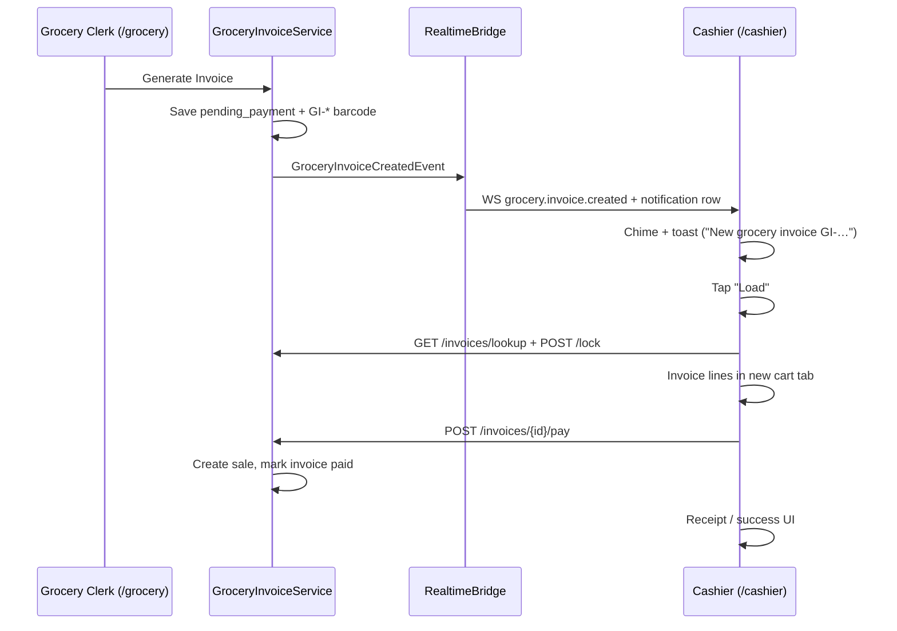
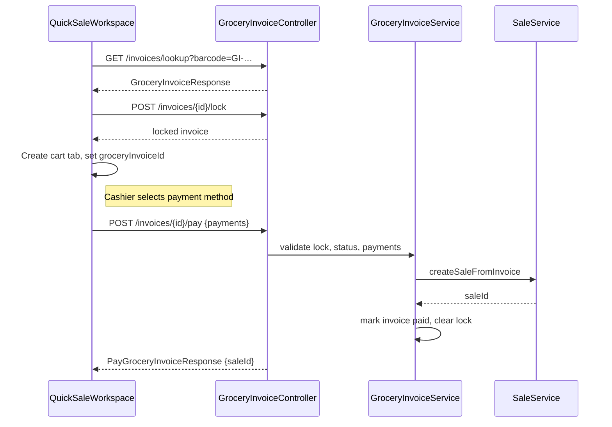

# Grocery Invoice → Cashier Forwarding — Scope

> **Status:** Draft v1.1 — Phases 1–3 implemented (frontend only)  
> **Surfaces:** Grocery counter at `http://kiosk.localhost:3000/grocery` → Cashier POS at `/cashier`  
> **Goal:** After a clerk generates a `GI-*` invoice, the cashier receives an audible alert, can click the notification to load the invoice, and complete payment.

---

## Table of Contents

1. [Executive Summary](#executive-summary)
2. [User Story](#user-story)
3. [Data Model & Event Payloads](#data-model--event-payloads)
4. [Current State (What Already Works)](#current-state-what-already-works)
5. [Gaps](#gaps)
6. [Proposed Experience](#proposed-experience)
7. [Technical Design](#technical-design)
8. [Implementation Plan (Phased)](#implementation-plan-phased)
9. [Error Handling & Edge Cases](#error-handling--edge-cases)
10. [Multi-Cashier Locking & Race Conditions](#multi-cashier-locking--race-conditions)
11. [Security & Permissions](#security--permissions)
12. [Accessibility & Autoplay](#accessibility--autoplay)
13. [Metrics & Observability](#metrics--observability)
14. [Risks & Mitigations](#risks--mitigations)
15. [Out of Scope](#out-of-scope)
16. [Testing Strategy](#testing-strategy)
17. [Open Decisions](#open-decisions)
18. [Appendix: Key Source References](#appendix-key-source-references)

---

## Executive Summary

The grocery counter and cashier POS are **already connected at the backend**. When a clerk taps **Generate Invoice** on `/grocery`, the server creates a `pending_payment` invoice with a `GI-*` barcode and immediately fans out a `grocery.invoice.created` event over WebSocket plus a durable `notifications` row.

The cashier layout already mounts `GroceryNotificationListener`, which shows a Sonner toast with a **Load** action. What is **missing** for the desired experience:

| Missing piece | Impact |
|---|---|
| **Sound chime** on new grocery invoice | Cashier may miss the toast in a busy store |
| **Deep-link handling** (`/cashier?invoice=GI-…`) | Clicking **Load** navigates but does not auto-load the invoice |
| **Pending-invoices badge refresh** on realtime event | Dropdown count stays stale until manually opened |
| **Payment wiring** for loaded `GI-*` carts | Checkout uses regular POS sale API; invoice stays `pending_payment` |

**No new backend endpoint is required** for forwarding. The work is primarily frontend UX: sound, deep-link load, live badge refresh, and checkout → `payGroceryInvoice`.

---

## User Story

> As a **grocery clerk**, after I generate an invoice for a customer, I want the cashier to be notified immediately so the customer can pay without walking to the counter with a paper barcode.
>
> As a **cashier**, when a new grocery invoice arrives, I want to hear a sound, see a clear notification, tap it to load the invoice into my POS, and complete payment in one flow.

### Happy path



---

## Data Model & Event Payloads

### Invoice lifecycle states

| State | Meaning | Next events |
|---|---|---|
| `pending_payment` | Invoice created, awaiting cashier payment | `locked`, `paid`, `cancelled`, `expired` |
| `locked` | A cashier has reserved it for payment (5 min TTL) | `paid`, `unlocked`, `expired` |
| `paid` | Payment completed, `saleId` recorded | — |
| `cancelled` | Clerk or manager cancelled the invoice | — |
| `expired` | TTL elapsed (configurable, default 24 h) | — |

### Realtime frame payload (`grocery.invoice.created`)

The WebSocket frame's `data` object (see `use-grocery-notifications.ts`) contains at least:

```ts
{
  barcodeCode: string;   // e.g. "GI-0000000123"
  grandTotal: number;    // e.g. 1250.00
  lineCount: number;     // e.g. 4
  createdByName: string; // e.g. "Alice M."
}
```

The REST polling path (`notification.created`) wraps the same payload in `frame.data.payload`.

### API types

Key types are already defined in `frontend/lib/grocery-api.ts`:

```ts
export type GroceryInvoiceResponse = {
  id: string;
  barcodeCode: string;
  status: GroceryInvoiceStatus; // pending_payment | paid | cancelled | expired
  branchId: string;
  subtotal: number;
  grandTotal: number;
  lines: GroceryInvoiceLineResponse[];
  expiresAt: string;
  createdBy: string;
  createdByName: string;
  createdAt: string;
  lockedBy?: string;
  lockedByName?: string;
  lockedAt?: string;
  lockExpiresAt?: string;
  saleId?: string;
};

export type PayGroceryInvoiceRequest = {
  payments: Array<{ method: string; amount: number; reference?: string }>;
};

export type PayGroceryInvoiceResponse = {
  invoiceId: string;
  saleId: string;
  status: string;
  paidAt: string;
  receipt: unknown;
};
```

### Cart session extension

`frontend/lib/cart-session.ts` currently has no grocery-specific fields. The implementation will extend `CartSession` with:

```ts
export type CartSession = {
  // …existing fields…
  groceryInvoiceId?: string;   // set when loaded from GI-* barcode
  groceryBarcode?: string;     // e.g. "GI-0000000123"
};
```

---

## Current State (What Already Works)

### Grocery counter — invoice generation

| Layer | File | Behavior |
|---|---|---|
| Page | `frontend/app/grocery/page.tsx` | Renders `GroceryWorkspace` |
| Workspace | `frontend/components/grocery/grocery-workspace.tsx` | Cart, **Generate Invoice** → `createGroceryInvoice()` or `issueGroceryDraftFromState()` |
| Success UI | `frontend/components/grocery/grocery-invoice-success.tsx` | Modal: barcode, print, "Show this barcode at the cashier…" |
| API client | `frontend/lib/grocery-api.ts` | `POST /api/v1/grocery/invoices` |

On success the clerk sees a toast and the success modal. **No extra "forward" action is needed** — the backend event fires on commit.

### Backend — automatic fan-out

`GroceryInvoiceService.createInvoice()` publishes `RealtimeBridge.GroceryInvoiceCreatedEvent`. The bridge:

1. Sends `grocery.invoice.created` (priority `HIGH`) to all WebSocket sessions on the branch **`grocery`** channel.
2. Inserts a `notifications` row (`type: grocery.invoice.created`, `userId: null` = all cashiers) with `actionUrl: /cashier?invoice={barcode}`.

Relevant backend files:

- `backend/.../grocery/application/GroceryInvoiceService.java`
- `backend/.../platform/realtime/RealtimeBridge.java` (`onGroceryInvoiceCreated`)

### Cashier — partial notification handling

| Layer | File | Behavior |
|---|---|---|
| Layout | `frontend/app/cashier/layout.tsx` | `RealtimeProvider` + `CashierOrderAlerts` + `GroceryNotificationListener` |
| Listener hook | `frontend/hooks/use-grocery-notifications.ts` | Toast on `grocery.invoice.created`; **Load** → `/cashier?invoice={barcode}` |
| Listener component | `frontend/components/grocery/grocery-notification-listener.tsx` | Mounts the hook (renders nothing) |
| POS workspace | `frontend/components/cashier/quick-sale-workspace.tsx` | GI-* barcode intercept in search bar → lookup, lock, load lines into cart tab (lines 1170–1251) |
| Pending list | `frontend/components/cashier/pending-invoices-panel.tsx` | Dropdown of `pending_payment` invoices (polls on open, 30s refresh) |

The existing GI-* intercept effect (`quick-sale-workspace.tsx`):

```ts
useEffect(() => {
  const q = search.trim();
  if (!q || !q.startsWith("GI-") || !online) return;
  if (loadedInvoiceRef.current.has(q)) return;
  // lookupGroceryInvoiceByBarcode(q) → lockGroceryInvoice(invoice.id)
  // → setCarts([...prev, freshCartWithInvoiceLines])
}, [search, online, branchId, setCarts, setActiveCartId, dismissCompletedSaleUi]);
```

### Sound precedent (web orders)

`frontend/components/cashier/cashier-order-alerts.tsx` plays `playNewOrderChime()` (880 Hz sine, 150 ms via Web Audio API) on `storefront.order.placed`. **Grocery invoices do not use this yet.**

### Role separation

| Role | Permissions | Surface |
|---|---|---|
| `grocery_clerk` | `grocery.invoices.create` | `/grocery` only (redirected away from `/cashier`) |
| `cashier` | `grocery.invoices.pay`, `sales.sell` | `/cashier` |

---

## Gaps

### 1. No sound on grocery invoice created

`use-grocery-notifications.ts` shows a toast only. In a noisy store the cashier may not notice.

**Fix:** Reuse or extract `playNewOrderChime()` from `cashier-order-alerts.tsx` and call it inside `handleInvoiceCreated`.

Consider a **distinct chime** for grocery vs web orders (e.g. two-tone or different frequency) so cashiers can tell them apart. See [Open Decisions](#open-decisions).

### 2. Deep link `/cashier?invoice=GI-…` is not handled

The notification **Load** action and backend `actionUrl` navigate to `/cashier?invoice={barcode}`, but `quick-sale-workspace.tsx` only reads `resumeDraft` from search params — not `invoice`.

Invoice loading today only triggers when the cashier **types or scans** `GI-*` into the search bar (effect keyed on `search` state).

**Fix:** Add a `useEffect` (mirror `resumeDraft` pattern, lines 696–709) that:

1. Reads `searchParams.get("invoice")`.
2. Sets `search` to the barcode (or calls a shared `loadGroceryInvoice(barcode)` helper directly).
3. Clears the query param from the URL (replace state, no full reload).
4. Guards with a ref so it runs once per navigation.

### 3. Toast **Load** does not load the invoice

Even after fixing the deep link, the flow depends on the cashier already being on `/cashier`. If they are on another tab within the app, `router.push` works; if the POS is idle, auto-load on mount completes the loop.

Optional enhancement: pass barcode via a custom event or shared ref if already on `/cashier` to avoid remount flicker.

### 4. Pending invoices panel does not live-update

`PendingInvoicesPanel` only refetches when opened or every 30 s while open. `invoiceRefreshKey` in `quick-sale-workspace.tsx` is bumped after a sale, not on `grocery.invoice.created`.

**Fix:** Export a small callback or context from the notification hook (or listen in `quick-sale-workspace`) to increment `invoiceRefreshKey` on create / paid / cancelled / expired events.

### 5. Checkout does not mark the grocery invoice paid

`quick-sale-workspace.tsx` loads invoice lines into a cart tab labeled with the barcode but completes checkout via the **regular POS sale path** (`tryPostSaleWithRetries`). It never calls `payGroceryInvoice()` or `unlockGroceryInvoice()`.

Result: a duplicate sale may be created while the `grocery_invoices` row stays `pending_payment` (lock expires after 5 minutes).

`frontend/components/cashier/cashier-invoice-payment.tsx` implements the correct pay flow (`lookup` → `payGroceryInvoice`) but is **not mounted anywhere**. It can be used as a reference for the payment payload shape and UI, but the recommended path is to wire payment directly into the existing POS cart flow.

**Fix (recommended):** When the active cart's `label` matches `^GI-` and checkout succeeds, call `POST /api/v1/grocery/invoices/{id}/pay` instead of (or after) the generic sale path. Track `groceryInvoiceId` on the cart session when loading from barcode.

Alternative: mount `CashierInvoicePayment` as a dedicated mode — heavier UX change.

### 6. Grocery clerk success screen has no "sent" feedback

The clerk sees "Show this barcode at the cashier" but no confirmation that the cashier was notified digitally.

**Fix (optional, Phase 2):** After generate, show copy like "Sent to cashier" when realtime is connected, or a subtle status line on `GroceryInvoiceSuccess`.

---

## Proposed Experience

### Grocery clerk (`/grocery`)

1. Build cart → **Generate Invoice**.
2. Success modal shows barcode (unchanged).
3. *(Optional)* Subtitle: "Cashier notified" when WS is healthy.

No new button required — forwarding is automatic on invoice creation.

### Cashier (`/cashier`)

1. **Chime** plays (once per invoice, deduped by `eventId`).
2. **Toast** appears (10 s, persistent enough to tap):
   - Title: `New grocery invoice GI-XXXXXXXXXX`
   - Body: `{n} items · {total} · by {clerk name}`
   - Action: **Load**
3. Tapping **Load**:
   - Navigates to `/cashier?invoice=GI-…` (if not already there).
   - Auto-loads invoice: lookup → lock → new cart tab with lines.
   - Clears URL param.
4. **Pending invoices** badge increments without opening the dropdown.
5. Cashier rings up payment as usual → **`payGroceryInvoice`** marks invoice paid and creates the canonical sale.
6. Toast on `grocery.invoice.paid` (already implemented) for other cashiers viewing the same branch.

### Sound behavior

| Event | Sound |
|---|---|
| `grocery.invoice.created` | Yes — chime on cashier station |
| `grocery.invoice.locked` | No |
| `grocery.invoice.paid` | No (optional soft tone — out of scope v1) |
| Duplicate event (WS + REST poll) | No — dedupe via `shownEventIds` (existing) |

Respect browser autoplay policy: first chime may require a prior user gesture on the page (cashier typically interacts with POS early in shift). Same constraint as web-order chime today.

---

## Technical Design

### Shared chime utility

Extract from `cashier-order-alerts.tsx`:

```ts
// frontend/lib/cashier-chime.ts (proposed)
export function playCashierChime(variant: "order" | "grocery" = "order"): void
```

- `order`: existing 880 Hz / 150 ms
- `grocery`: propose 660 Hz + 880 Hz two-pulse (~300 ms total) for differentiation

Both `CashierOrderAlerts` and `useGroceryNotifications` import this helper.

Implementation sketch:

```ts
export function playCashierChime(variant: "order" | "grocery" = "order") {
  try {
    const ctx = new AudioContext();
    const now = ctx.currentTime;
    const gain = ctx.createGain();
    gain.gain.value = 0.08;
    gain.connect(ctx.destination);

    if (variant === "order") {
      const osc = ctx.createOscillator();
      osc.type = "sine";
      osc.frequency.value = 880;
      osc.connect(gain);
      osc.start(now);
      osc.stop(now + 0.15);
    } else {
      [660, 880].forEach((freq, i) => {
        const osc = ctx.createOscillator();
        osc.type = "sine";
        osc.frequency.value = freq;
        osc.connect(gain);
        osc.start(now + i * 0.12);
        osc.stop(now + i * 0.12 + 0.12);
      });
    }

    void ctx.close();
  } catch {
    // Audio not available — toast still shows
  }
}
```

### Deep-link load in `quick-sale-workspace.tsx`

Follow the existing `resumeDraft` pattern (~lines 696–709):

```ts
const invoiceParamHandledRef = useRef(false);

useEffect(() => {
  const barcode = searchParams.get("invoice")?.trim();
  if (!barcode || !barcode.startsWith("GI-")) return;
  if (invoiceParamHandledRef.current) return;
  if (!online || !branchId.trim()) return;
  invoiceParamHandledRef.current = true;

  setSearch(barcode); // triggers existing GI- intercept effect
  // strip ?invoice= from URL via router.replace("/cashier", { scroll: false })
}, [searchParams, online, branchId, ...]);
```

Refactor the GI- load logic into `loadGroceryInvoiceByBarcode(barcode: string)` so deep link, search intercept, and `PendingInvoicesPanel.onLoadInvoice` share one code path.

### Notification → badge refresh

Option A (minimal): In `use-grocery-notifications.ts`, dispatch a `window` custom event:

```ts
window.dispatchEvent(
  new CustomEvent("grocery-invoice-event", {
    detail: { type: "created", barcode, eventId },
  }),
);
```

`quick-sale-workspace.tsx` listens and bumps `invoiceRefreshKey`:

```ts
useEffect(() => {
  const handler = (e: CustomEvent) => {
    const type = e.detail?.type;
    if (["created", "paid", "cancelled", "expired", "unlocked"].includes(type)) {
      setInvoiceRefreshKey((k) => k + 1);
    }
  };
  window.addEventListener("grocery-invoice-event", handler as EventListener);
  return () => window.removeEventListener("grocery-invoice-event", handler as EventListener);
}, []);
```

Option B: React context on cashier layout. Prefer **Option A** for fewer provider changes.

### Checkout → pay grocery invoice

Extend cart session type:

```ts
type CartSession = {
  // existing fields…
  groceryInvoiceId?: string;  // set when loaded from GI- barcode
  groceryBarcode?: string;
};
```

On load (inside the GI- intercept effect):

```ts
fresh.groceryInvoiceId = invoice.id;
fresh.groceryBarcode = invoice.barcodeCode;
```

On successful payment when `groceryInvoiceId` is set, replace the generic sale path with:

```ts
const payments = buildGroceryPaymentsFromCart(activeCart);
const idem = nextIdempotencyKey();
const result = await payGroceryInvoice(groceryInvoiceId, { payments }, idem);
```

`buildGroceryPaymentsFromCart` maps the cart's payment method to the `PayGroceryInvoiceRequest` shape:

- `cash` → `[{ method: "cash", amount: total }]`
- `mpesa_manual` → `[{ method: "mpesa_manual", amount: total, reference: mpesaRef }]`
- `split` → `[{ method: "cash", amount: cashSplit }, { method: "mpesa_manual", amount: mpesaSplit, reference: splitMpesaRef }]`

Skip the generic `POST /sales` path for grocery-sourced carts (backend `payGroceryInvoice` already creates the sale).

On payment failure or cart abandon: call `unlockGroceryInvoice` (best-effort).

### Payment sequence diagram



### Clerk-side confirmation (optional)

`GroceryWorkspace` already runs inside `RealtimeProvider` (`frontend/app/grocery/layout.tsx`). Could subscribe to `grocery.invoice.locked` scoped to the invoice just created to show "Cashier is processing…" — nice-to-have, not v1.

---

## Implementation Plan (Phased)

### Phase 1 — Notify & load (frontend only, no backend changes)

| # | Task | File(s) | Effort | Risk |
|---|---|---|---|---|
| 1.1 | Extract `playCashierChime` | `frontend/lib/cashier-chime.ts`, update `cashier-order-alerts.tsx` | S | Low |
| 1.2 | Play chime on invoice created | `frontend/hooks/use-grocery-notifications.ts` | XS | Low |
| 1.3 | Handle `?invoice=` deep link | `frontend/components/cashier/quick-sale-workspace.tsx` | S | Low |
| 1.4 | Refactor shared `loadGroceryInvoiceByBarcode` | `quick-sale-workspace.tsx` | M | Medium |
| 1.5 | Live-update pending badge | `use-grocery-notifications.ts` + `quick-sale-workspace.tsx` | S | Low |

**Acceptance:** Clerk generates invoice → cashier hears chime → taps Load → cart tab opens with correct lines.

### Phase 2 — Complete payment correctly

| # | Task | File(s) | Effort | Risk |
|---|---|---|---|---|
| 2.1 | Extend `CartSession` with `groceryInvoiceId`/`groceryBarcode` | `frontend/lib/cart-session.ts` | XS | Low |
| 2.2 | Store `groceryInvoiceId` on cart when loading GI- | `quick-sale-workspace.tsx` | XS | Low |
| 2.3 | Build `PayGroceryInvoiceRequest` from cart payment state | `quick-sale-workspace.tsx` | M | Medium |
| 2.4 | Route checkout through `payGroceryInvoice` when cart is grocery-sourced | `quick-sale-workspace.tsx` | M | High |
| 2.5 | Unlock on abandon / error | `quick-sale-workspace.tsx` | S | Medium |
| 2.6 | Verify shift-open guard (backend requires open shift) | existing shift checks | XS | Low |

**Acceptance:** After checkout, invoice status is `paid`, `saleId` is set, no duplicate POS sale.

### Phase 3 — Polish (optional)

| # | Task | Notes |
|---|---|---|
| 3.1 | Clerk "Cashier notified" copy | `grocery-invoice-success.tsx` ✅ |
| 3.2 | Distinct grocery vs order chime | `cashier-chime.ts` ✅ |
| 3.3 | Richer toast (item preview) | `use-grocery-notifications.ts` — requires backend event payload to include item names |
| 3.4 | Mobile cashier app `grocery` channel | `mobile/packages/realtime/` — out of frontend scope |
| 3.5 | Decide fate of `CashierInvoicePayment` | Deleted; pay logic now lives in `quick-sale-workspace.tsx` ✅ |

---

## Error Handling & Edge Cases

| Scenario | Handling |
|---|---|
| **Cashier offline when invoice created** | REST polling fallback (`notification.created`) delivers the toast when connectivity returns. Dedupe via `shownEventIds`. |
| **Invoice already locked by another cashier** | `lockGroceryInvoice` returns HTTP 409. Show toast: "Invoice GI-… is being processed by {name}" and clear search/URL param. |
| **Invoice paid/cancelled/expired before load** | `lookupGroceryInvoiceByBarcode` returns the status. Show an explanatory toast and do not create a cart. |
| **Invoice cancelled/expired while cart is open** | On checkout, `payGroceryInvoice` will fail with 400/409. Show error and clear cart. |
| **Payment fails after lock acquired** | Best-effort `unlockGroceryInvoice` call. If network is down, lock expires automatically after 5 minutes. |
| **Browser blocks autoplay** | First chime is silent; toast still shows. Cashier interaction unblocks future chimes. Document in onboarding. |
| **Duplicate WS + REST event** | `shownEventIds` dedupes by `eventId` / notification id. Chime plays once. |
| **Deep link opened by non-cashier** | Server-side permission check on `/lookup` and `/pay` returns 403; UI shows access-denied message. |
| **Multiple `?invoice=` navigations in one session** | Guard ref resets only on full page reload; new toasts overwrite URL param via `router.replace`. |

---

## Multi-Cashier Locking & Race Conditions

The backend lock semantics are the source of truth:

- `POST /lock` succeeds only for `pending_payment` invoices.
- A second `POST /lock` while locked returns **409 Conflict**.
- The lock TTL is **5 minutes**.
- `POST /pay` requires a valid lock held by the paying cashier.

Frontend responsibilities:

1. **Lock early** — immediately after lookup, before creating the cart tab.
2. **Handle 409 gracefully** — do not create a cart if another cashier locked it.
3. **Do not rely on lock for idempotency** — always send an `Idempotency-Key` header with `payGroceryInvoice`.
4. **Unlock on abandon** — if the cashier clears the cart or navigates away, call `unlockGroceryInvoice`.
5. **Stale cart detection** — if `grocery.invoice.cancelled` / `grocery.invoice.expired` / `grocery.invoice.paid` arrives for the loaded barcode, disable checkout and show a warning.

---

## Security & Permissions

| Check | Where |
|---|---|
| Clerk can create | Backend `grocery.invoices.create` on `POST /api/v1/grocery/invoices` |
| Cashier can pay | Backend `grocery.invoices.pay` on `POST /api/v1/grocery/invoices/{id}/pay` |
| Cashier can sell | Backend `sales.sell` (sale creation inside pay) |
| Branch scoping | All grocery APIs require `branchId`; cashier dashboard provides it |
| Invoice lookup | Returns only invoices for the cashier's current branch |
| UI route guard | `frontend/app/cashier/layout.tsx` redirects `grocery_clerk` away from `/cashier` |

No new permissions are required.

---

## Accessibility & Autoplay

- Toasts already use Sonner, which respects `prefers-reduced-motion`.
- The chime is a secondary cue; the visual toast is the primary notification.
- Consider adding `aria-live="polite"` to a hidden status region if Sonner toasts are not already announced by screen readers.
- Autoplay policy: the Web Audio API `AudioContext` may start in a suspended state until a user gesture. Catch `DOMException` and resume on the next user interaction if needed.

---

## Metrics & Observability

| Metric | Instrumentation |
|---|---|
| Invoice created → cashier notification latency | Log timestamp delta in `useGroceryNotifications` (WS `receivedAt` vs frame `createdAt`). |
| Chime play success/failure | Wrap `playCashierChime` in a try/catch and log to console (no analytics endpoint required). |
| Load conversion | Count taps on toast **Load** action vs invoices created. |
| Pay success rate | Track `payGroceryInvoice` 2xx vs error responses. |
| Duplicate event rate | Size of `shownEventIds` over a shift. |

No new backend telemetry is required for v1.

---

## Risks & Mitigations

| Risk | Impact | Mitigation |
|---|---|---|
| **Payment wired incorrectly** creates a regular POS sale but leaves invoice unpaid | High — data inconsistency, customer charged twice | Add unit/E2E test for grocery cart checkout; assert invoice status = `paid` and exactly one sale. |
| **Autoplay blocks chime** | Low — visual toast remains | Document gesture requirement; consider a one-time "Enable sounds" button in POS settings. |
| **Race: two cashiers load same invoice** | Medium — one gets 409, poor UX | Already handled by backend lock; ensure frontend shows friendly message and does not create a cart. |
| **Realtime frame payload differs from lookup response** | Low — cart totals may mismatch | Use lookup response as source of truth for cart lines; use frame only for notification. |
| **Unused `CashierInvoicePayment` drift** | Low — two sources of pay logic | Decide in Phase 3: either delete it or make it the single source of truth. |
| **Mobile cashier app not notified** | Medium — feature parity gap | Add to Phase 3; same realtime channel already exists. |

---

## Out of Scope

- **New "Forward to Cashier" API** — creation already triggers realtime fan-out.
- **Push notifications** for grocery invoices (Web Push infra exists but not wired per event).
- **Grocery clerk receiving pay/cancel updates** on `/grocery` main workspace (only matters for `/grocery/invoices` history).
- **Physical barcode scanner hardware** — GI- scan in search bar already works; USB scanner types into search.
- **Butcher / other invoice types** — this scope is grocery `GI-*` only.
- **Backend schema changes** — none anticipated.
- **Receipt formatting changes** — use existing POS receipt builder.

---

## Testing Strategy

### Manual (two browsers / two users)

1. Log in as `grocery_clerk` on `kiosk.localhost:3000/grocery`.
2. Log in as `cashier` on `kiosk.localhost:3000/cashier` (same branch).
3. Clerk: add items → Generate Invoice.
4. Cashier: verify chime + toast within ~1 s.
5. Cashier: tap **Load** → cart tab with correct lines and total.
6. Cashier: complete payment → invoice `paid` in pending panel / API.
7. Repeat with cashier on a different route → **Load** still works.
8. Duplicate event: disable WS, rely on REST poll → single toast/chime (dedupe).
9. Race: open two cashier sessions, tap **Load** on both → one succeeds, one shows "locked by another cashier".
10. Offline: create invoice while cashier offline → reconnect and ensure toast appears.

### Automated (follow-up)

- Unit test: `playCashierChime` does not throw when `AudioContext` unavailable.
- Unit test: `buildGroceryPaymentsFromCart` returns correct payload for cash/mpesa/split.
- Integration: mock realtime frame → hook calls chime once per `eventId` and dispatches badge-refresh event.
- E2E (Playwright): two contexts, generate → notification → load → pay → assert invoice status.

---

## Open Decisions

| # | Question | Recommendation |
|---|---|---|
| 1 | Same chime as web orders or distinct? | **Distinct two-tone** for grocery — reduces confusion when both channels are active. |
| 2 | Auto-load without tapping **Load**? | **No for v1** — cashier may be mid-sale; toast + tap is safer. Revisit with user testing. |
| 3 | Wire pay in quick-sale vs mount `CashierInvoicePayment`? | **Wire pay in quick-sale** — keeps single POS UX; reuse pay logic from `cashier-invoice-payment.tsx`. |
| 4 | Show "Cashier notified" on clerk success modal? | **Phase 3** — requires WS health signal or optimistic copy. |
| 5 | Sound on locked/paid for other cashiers? | **No for v1** — info toasts only (already implemented). |
| 6 | Delete or repurpose `CashierInvoicePayment.tsx`? | Deleted; pay logic now lives in `quick-sale-workspace.tsx` ✅ |

---

## Appendix: Key Source References

| Area | Path |
|---|---|
| Invoice generation | `frontend/components/grocery/grocery-workspace.tsx` (`onGenerate`) |
| Success modal | `frontend/components/grocery/grocery-invoice-success.tsx` |
| Grocery API | `frontend/lib/grocery-api.ts` |
| Realtime client | `frontend/lib/realtime.ts` |
| Cashier notifications | `frontend/hooks/use-grocery-notifications.ts` |
| Cashier layout | `frontend/app/cashier/layout.tsx` |
| POS + GI- load | `frontend/components/cashier/quick-sale-workspace.tsx` (lines 1170–1251) |
| POS deep-link pattern | `frontend/components/cashier/quick-sale-workspace.tsx` (lines 696–709) |
| POS checkout | `frontend/components/cashier/quick-sale-workspace.tsx` (lines 1686–1828) |
| Web order chime | `frontend/components/cashier/cashier-order-alerts.tsx` (`playCashierChime`) |
| Pending invoices dropdown | `frontend/components/cashier/pending-invoices-panel.tsx` |
| Cart session type | `frontend/lib/cart-session.ts` |
| Backend create + event | `backend/.../grocery/application/GroceryInvoiceService.java` |
| Backend realtime fan-out | `backend/.../platform/realtime/RealtimeBridge.java` (`onGroceryInvoiceCreated`) |
| Related prior scope | `frontend/docs/GROCERY_CART_PERSISTENCE_SCOPE_REVISED.md` |

### API endpoints (no changes expected)

| Method | Path | Role |
|---|---|---|
| POST | `/api/v1/grocery/invoices` | Clerk creates invoice |
| GET | `/api/v1/grocery/invoices?branchId=...&status=...` | List invoices |
| GET | `/api/v1/grocery/invoices/lookup?barcode=` | Cashier lookup |
| POST | `/api/v1/grocery/invoices/{id}/lock` | Cashier lock (5 min) |
| POST | `/api/v1/grocery/invoices/{id}/unlock` | Release lock |
| POST | `/api/v1/grocery/invoices/{id}/pay` | Cashier pay → creates sale |
| POST | `/api/v1/grocery/invoices/{id}/cancel` | Cancel invoice |
| POST | `/api/v1/realtime/tickets` | WS ticket (channels: `grocery`, `notifications`) |

### Example API request/response

**Lookup:**

```http
GET /api/v1/grocery/invoices/lookup?barcode=GI-0000000123
```

```json
{
  "id": "inv_abc123",
  "barcodeCode": "GI-0000000123",
  "status": "pending_payment",
  "branchId": "branch_1",
  "subtotal": 1200.00,
  "grandTotal": 1250.00,
  "lines": [
    {
      "id": "line_1",
      "itemId": "item_1",
      "itemName": "Brown Rice 1kg",
      "quantity": 2,
      "unitName": "pc",
      "unitPrice": 600.00,
      "lineTotal": 1200.00
    }
  ],
  "expiresAt": "2026-07-03T19:37:27Z",
  "createdByName": "Alice M."
}
```

**Pay:**

```http
POST /api/v1/grocery/invoices/inv_abc123/pay
Idempotency-Key: idem_abc123
```

```json
{
  "payments": [
    { "method": "cash", "amount": 1250.00 }
  ]
}
```

```json
{
  "invoiceId": "inv_abc123",
  "saleId": "sale_xyz789",
  "status": "paid",
  "paidAt": "2026-07-02T19:37:27Z",
  "receipt": { /* … */ }
}
```
